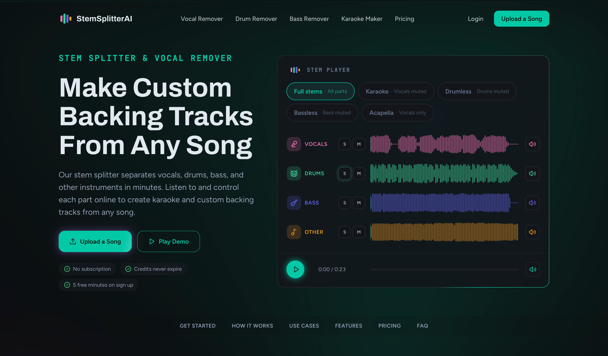
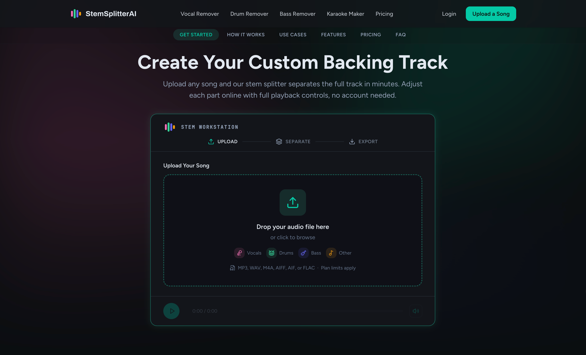
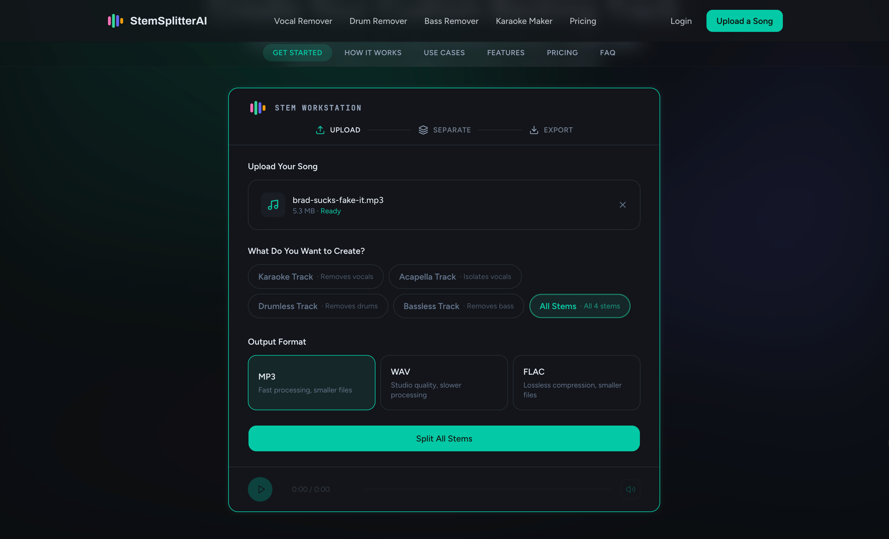
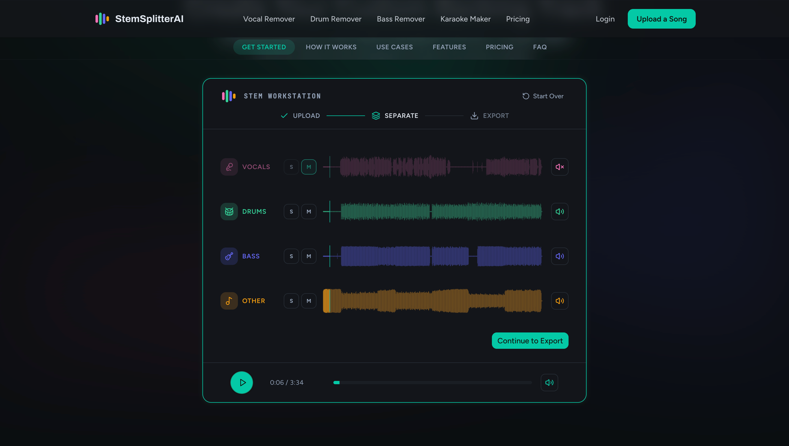
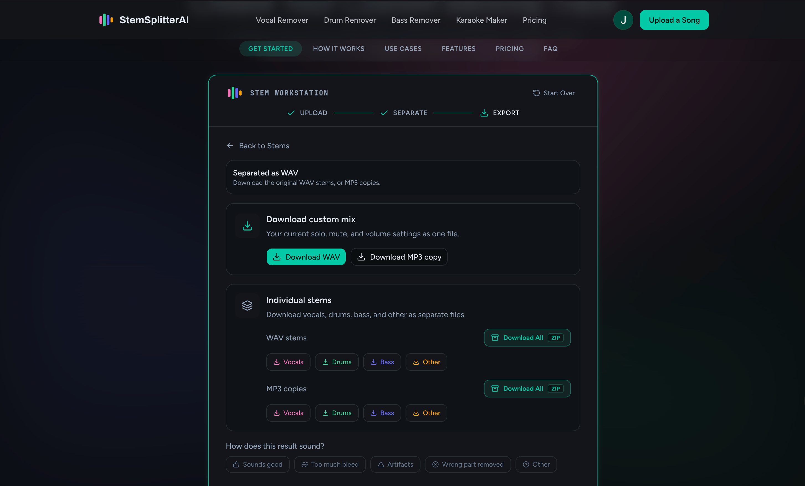

# StemSplitterAI

AI-powered stem splitter that creates custom backing tracks from any song.

**Website: [stemsplitterai.com](https://stemsplitterai.com)**

## What it does

StemSplitterAI separates any song into individual stems - vocals, drums, bass, and other instruments. Create custom backing tracks for practice, performance, karaoke, and music education.

## Features

- AI stem separation with multi-format export (WAV, MP3, FLAC)
- Interactive waveform workstation with per-stem volume, mute, and solo controls
- Task presets: Vocal Remover, Drum Remover, Bass Remover, Karaoke Maker, Full Stems
- Free 5-minute trial (no signup) plus 3 free minutes daily for registered users
- One-time Minute Packs from $1.99 (no subscription, minutes never expire) or an Unlimited Plan from $9.99/month

## How it works

### 1. Homepage - listen before you upload

The homepage features a live stem player so you can hear what separated stems sound like before uploading anything. Toggle between Full Stems, Karaoke, Drumless, Bassless, and Acapella modes in real time.

### 2. Upload your song

Drag and drop any audio file into the Stem Workstation. Supports MP3, WAV, M4A, AIFF, AIF, and FLAC.

### 3. Choose your mode and output format

Pick what you want to create - Karaoke Track, Acapella Track, Drumless Track, Bassless Track, or All Stems. Then choose your output format: MP3 for speed, WAV for studio quality, or FLAC for lossless compression.

### 4. Preview and customize your stems

Listen to the separated stems in the interactive waveform workstation. Solo, mute, and adjust the volume of each stem. Preview the exact mix you want before exporting.

### 5. Export and download

Download your custom mix as a single file (WAV or MP3), or grab each stem individually. All WAV and MP3 stems available as separate downloads or as a ZIP bundle.

## Use cases

- **Instrumentalists** - Remove your instrument, practice with the band
- **Singers & Karaoke** - Strip vocals from any song
- **Performers & Bands** - Custom backing tracks for live shows
- **Music Teachers** - Tailored practice material for students
- **DJs & Remixers** - Extract full stems for mashups and edits

## Pricing

| Plan | Processing | Price |
|------|-----------|-------|
| Free trial (no signup) | 5 min | $0 |
| Daily free (registered) | 3 min/day | $0 |
| Starter Pack | 10 min | $1.99 |
| 12-Minute Pack | 12 min | $6.99 |
| 300-Minute Pack | 300 min | $39.99 |
| Unlimited (monthly) | Unlimited | $9.99/mo |
| Unlimited (yearly) | Unlimited | $59.88/yr |

One-time Minute Packs never expire and need no subscription. The 300-Minute Pack and Unlimited Plan include Batch Mode.

## Try it

Visit [stemsplitterai.com](https://stemsplitterai.com) - upload any song and get a free 5-minute trial instantly, no account needed.
